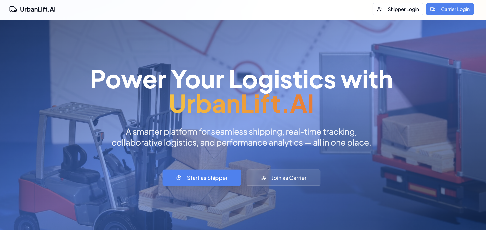
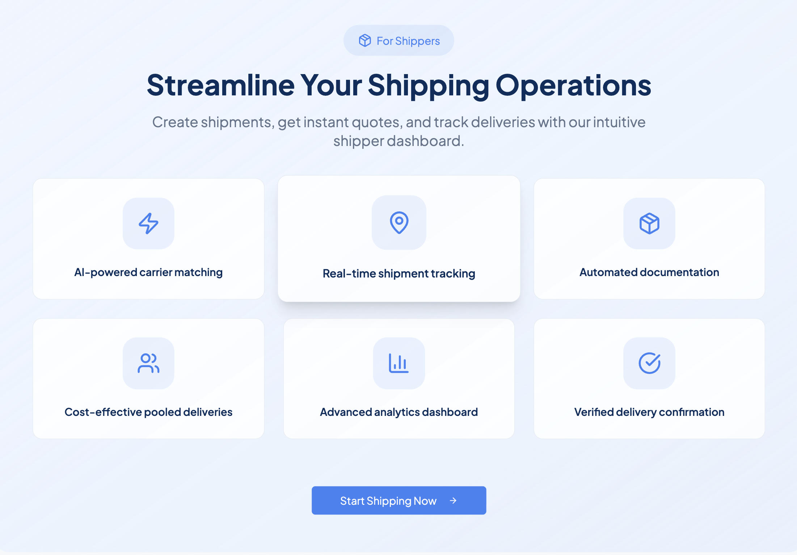
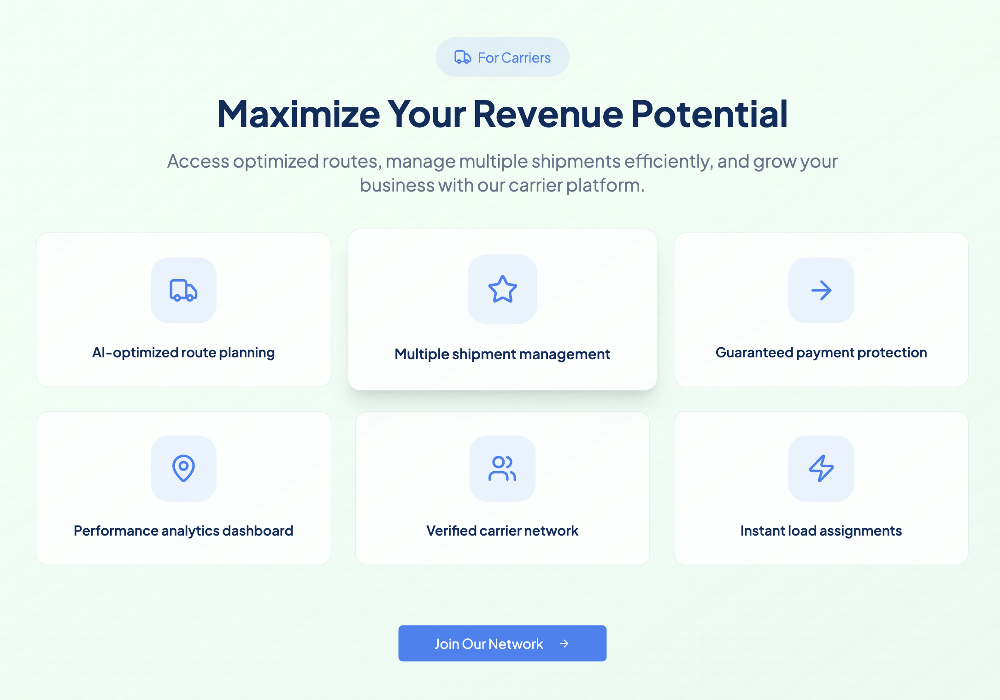
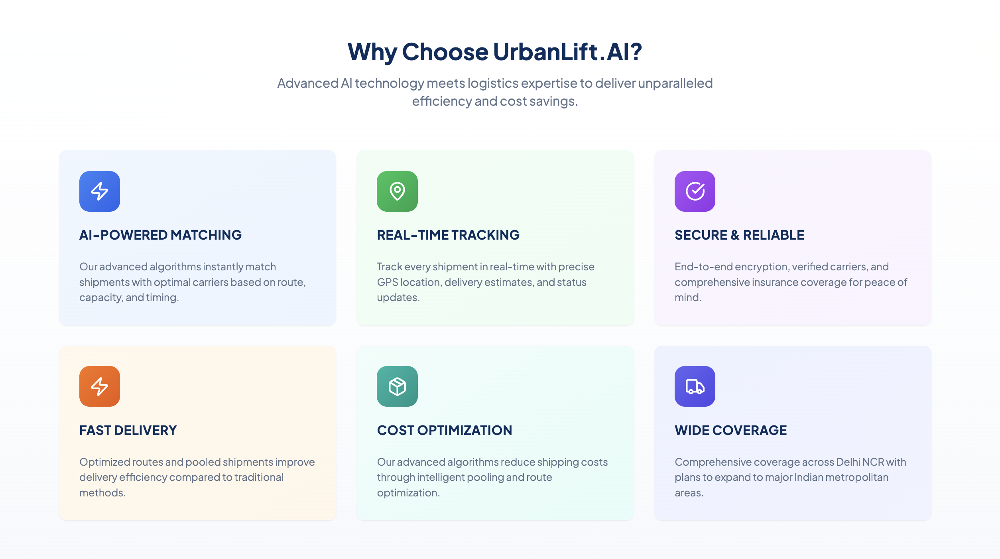

# Delhi MSME Logistics Platform – Shipper & Carrier Network

An open, Delhi-focused logistics web app that connects MSME shippers with verified carriers. It provides dual onboarding, shipment creation, live tracking on a Leaflet map, community engagement, and a gamified leaderboard for performance. Built with React, Vite, TypeScript, Tailwind (with semantic tokens), shadcn-ui, and Supabase.


**Live Demo:** [urban-lift-ai.vercel.app](https://urban-lift-ai-66.vercel.app/)

---

## Screenshots

| Home | Shipper Dashboard | Carrier Dashboard | Our USP |
|------|--------------------|-------------------|----------------|
|  |  |  |  |

---
## Why this project
- MSMEs in NCR/Delhi face fragmented capacity, variable rates, and reliability gaps for both last‑mile and line‑haul.
- Carriers struggle to keep utilization high across peak/off‑peak and find direct MSME contracts.
- This app bridges demand and supply with transparent workflows, instant quoting, simple tracking, and community trust signals (leaderboard, profiles).


## Key features
- **Dual user flows**: separate auth and dashboards for Shippers and Carriers.
- **Shipment lifecycle**: create, quote, dispatch, and track shipments.
- **Live map and picker**: Leaflet-based interactive map and origin/destination selection.
- **AI Dispatch Assistant (MCDA Matching)**: Factors in proximity (35%), capacity fit (25%), reputation & experience (20%), and carrier reliability scores (20%) using a multi-criteria scoring engine in `src/lib/dispatch/recommender.ts`.
- **Recommendation Explanation Panel**: Displays visual score breakdown progress bars on recommendations cards so shippers can verify matching components (Proximity, Capacity, Reputation, Reliability).
- **Dispatch State Machine (FSM)**: Enforces strict sequential transitions (`pending` ➔ `assigned` ➔ `in_transit` ➔ `delivered`) via `src/lib/dispatch/state-machine.ts` to guarantee shipment state integrity.
- **Chronological Shipment Audit Timeline**: Renders a vertical log timeline of shipment milestones (allocation, pickup, transit logs, delivery signatures).
- **Smart Notification Center**: Features a real-time header bell dropdown in the navbar showing unread badges, read/delete actions, and navigation shortcuts to view shipments.
- **Operations Analytics Dashboard**: Consolidates freight patterns, direct vs pooled run ratios, and carrier performance charts.
- **Route Optimization & K-Means Pooling**: Consolidates deliveries with matching bearings and overlapping pick-up times into pooled runs.
- **Community and Leaderboard**: Social proof, recognition, and gamification points for NCR/Delhi logistics.
- **Responsive UI**: Mobile-first, semantic tokens for light/dark theming.
- **Supabase integration**: Auth, database proxying, and storage fallback ready out‑of‑the‑box.


## Tech stack
- React 18 + Vite + TypeScript
- Tailwind CSS with semantic tokens (`index.css`, `tailwind.config.ts`)
- shadcn-ui + Radix Primitives
- React Router v6
- React Query (TanStack) for data fetching/cache
- Leaflet + React-Leaflet for maps
- Recharts for dashboard visualizations
- Supabase (auth, DB, storage) + browser LocalStorage Proxy Client fallback


## Project structure (high-level)
- `src/pages`: top-level routed pages (Home, Auth, Shippers/Carriers workspaces, Ops Analytics)
- `src/components`: reusable building blocks (LiveMap, MapPicker, Navbar, dashboard cards)
- `src/components/ui`: shadcn components and primitives
- `src/hooks`: shared hooks (auth, toasts, mobile)
- `src/lib`: core utilities and algorithms:
  - `src/lib/dispatch`: recommender match scoring (`recommender.ts`) and finite state machine validations (`state-machine.ts`)
  - `src/lib/logistics`: Haversine math and K-Means pooling logic (`pooling.ts`)
  - `src/lib/timeline`: chronological events logging and push notification triggers (`audit-logger.ts`)
- `src/assets`: theme images used by the UI
- `src/integrations/supabase`: client initialization and connection fallback proxy


## Setup and development
1) Prerequisites
- Node.js 18+ and npm

2) Clone and install
```
git clone <your_repo_url>
cd <your_repo_folder>
npm i
```

3) Start the app (development)
```
npm run dev
```
- Vite dev server runs at http://localhost:8080

4) Supabase configuration (two options)
- Use the bundled configuration (no changes needed):
  The app ships with a working Supabase URL and anon key in src/integrations/supabase/client.ts so you can run it immediately.
- Bring your own Supabase (recommended for production):
  1. Create a new Supabase project
  2. Copy your Project URL and anon public key
  3. Update src/integrations/supabase/client.ts (SUPABASE_URL and SUPABASE_PUBLISHABLE_KEY)
  4. Enable email/password auth and create the tables/policies you need (see Data model section below)

5) Build and preview (production)
```
npm run build
npm run preview
```
- Preview starts a local static server and prints the URL in the console.

6) Run local test suites
```
npx tsx src/lib/dispatch/state-machine.test.ts
npx tsx src/lib/dispatch/recommender.test.ts
```

## Future Operational Features

- **Live Capacity Heatmap for Carriers**: Help drivers identify high-demand pickup zones in Bawana, Okhla, and Narela to minimize empty-mile routes.
- **In-App Shipper-Carrier Chat**: Direct messaging between shippers and assigned carriers to coordinate gate entries and warehouse queues.
- **Milestone Proof of Delivery (PoD)**: Enable drivers to upload digital signatures and consignee delivery receipts.
- **Dynamic Traffic Rerouting**: Real-time traffic alerts on main corridors (NH-48, Outer Ring Road) suggesting alternative paths during peak congestion.
- **Carrier Rewards Store**: Allow commercial drivers to redeem accrued leaderboard performance points for fuel discount vouchers.